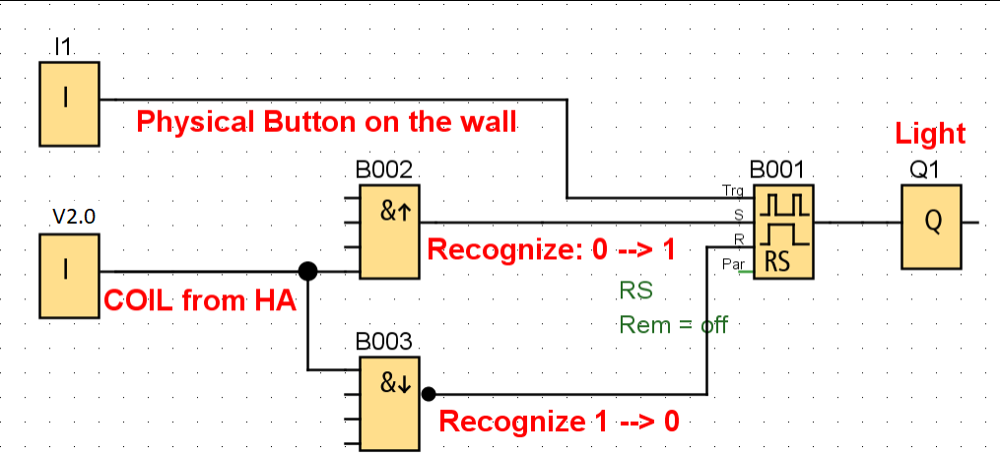

# Home Assistant Custom Integration: modbus_logo


_Integration to integrate with [integration_blueprint][integration_blueprint]._

[modbus](http://www.modbus.org/) is a communication protocol to control PLCs (Programmable Logic Controller) and RTUs (Remote Terminal Unit).

The integration adheres to the [protocol specification](https://www.modbus.org/docs/Modbus_Application_Protocol_V1_1b3.pdf) using [pymodbus](https://github.com/pymodbus-dev/pymodbus) for the protocol implementation.

The modbus_logo *custom integration* supports all devices adhering to the modbus standard. The communication to the device/devices can be serial (rs-485), TCP, or UDP connections. The modbus integration allows multiple communication channels e.g. a serial port connection combined with one or more TCP connections.

This integration is built on top of official components in home-assistant and extend some functionality.
Documentation of this integration is the same of the official [documentation](https://www.home-assistant.io/integrations/modbus/).

Continuing in the reading of this file you'll find the documentation for the added specific feature.


## Supported entity

Currently (HA core v2024.6.0) all entities already supported by official component are supported:
- binary_sensor
- climate
- cover
- fan
- light
- sensor
- switch

## Prerequisites

* [Home Assistant (hass)](https://www.home-assistant.io/) >= 2024.6
* [pymodbus](https://github.com/pymodbus-dev/pymodbus) == 3.6.8 will load automatically.
* [HACS](https://hacs.xyz/docs/setup/download/)

## Installation

> **Note**
> This integration requires [HACS](https://hacs.xyz/docs/setup/download/) to be installed

1. Open HACS
2. Open the options in the top right and select _Custom repositories_
3. Enter this repository's URL (`https://github.com/nos86/hacs-modbus-logo`) under the Category _Integration_.
4. Press _Add_
5. _+ EXPLORE & DOWNLOAD REPOSITORIES_
6. Find _Modbus Pulse_ in this list
7. _DOWNLOAD THIS REPOSITORY WITH HACS_
8. _DOWNLOAD_
9. Restart Home Assistant (_Settings_ > _System_ >  _RESTART_)

## Configuration

modbus_logo is configured in the `configuration.yaml` file under the *modbus_logo* domain.
Configuration is the same as the integrated modbus integration so see the modbus integration documentation for more information:
https://www.home-assistant.io/integrations/modbus/

If you have already the modbus component configured, to switch to modbus_plc is enough to rename the key in your configuration file from *modbus* to *modbus_plc*

### Enhanced switch / fan / light
with v0.2.0, a new flag has been added inside verify section: **sync**. This flag is False by default. This flag is available for: _SWITCH, LIGHT, FAN_

When it is activated, it forces the same status between Home Assistant and PLC input.
This solves the issue that happens when output state in PLC changes and Home Assistant updates the UI state disaligning it from PLC Network input state.

What this is, just, send back the new state to PLC as soon as an internal update event is triggered inside Home Assistant.
The command sent to PLC is the same when you command a turn_on or a turn_off

**WARNING**: please, pay attention to unwanted loop (where HA updates PLC, PLC reacts changing its status, and this trigger again HA....).
Use this setting, only if you know what you are doing.

Finally below a short example of configuration that uses this flag:
```yaml
modbus_logo:
# I1-24      -->    0 -   23 (input)
# Q1-20      --> 8192 - 8211 (coil)
# M1-64      --> 8256 - 8319 (coil)
# V0.0-850.7 -->    0 - 6807 (coil)
# AI 1-8     -->    0 -    7
# VW 0-850   -->    0 -  424
# AQ 1-8     -->  512 -  519
# AM 1-64    -->  528 -  591
  - name: plc
    type: tcp
    host: 10.148.0.32
    port: 502
    lights:
      - name: corridor
        address: 16 #V2.0
        write_type: coil
        scan_interval: 1
        verify:
          input_type: coil
          address: 8192 #Q1
          sync: true # <-- this is the new flag
```
In this example, the switch in Home Assistant sets the network input (V2.0), then PLC logic will apply a certain logic that has as effect that output Q1 will be set. Then, HA will "verify" that actually Q1 is set to confirm the state of the UI Switch. Later, if Q1 changes (for example, because I used the wall switch to command the light), HA will "verify" the new state (according to _scan_interval_ time) and update the UI switch accordly. At this moment, the new UI state will be sent to network input V2.0 of PLC and it will be set to zero. Same story, if the light is off and I switch it on from wall switch.

To complete the example, below is reported the logic used in the PLC: (in this example, it is supped that physical device is a **button**)


## Opening an issue

Please open issue, only in case of issues related to extension in this repository

## Contributions are welcome!

If you want to contribute to this please read the [Contribution guidelines](CONTRIBUTING.md)

